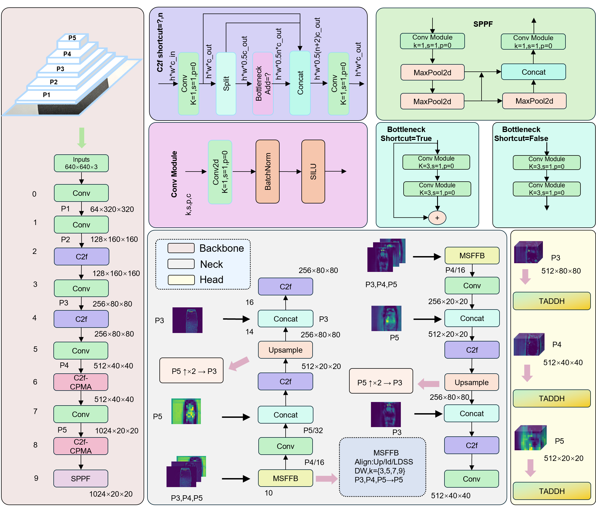

# CMT-YOLO: A Lightweight Defect Detection Framework for Low-Contrast Rubber Transmission-Belt Defects

This repository provides the implementation of **CMT-YOLO**, a lightweight object detector designed for **low-contrast rubber transmission-belt surface defect detection** under industrial conditions.

CMT-YOLO is built upon the YOLOv8 detection pipeline and introduces targeted modifications to the **backbone**, **neck**, and **detection head** to improve weak-defect representation, multi-scale feature interaction, and classification–localization coordination.

---

## 1. Introduction

Surface defects on black rubber transmission belts are difficult to detect in real production environments because the captured images often suffer from:

- low contrast between defects and background,
- repetitive dark textures,
- weak and ambiguous boundaries,
- reflective interference,
- and large variation in defect scale and appearance.

To address these challenges, this work proposes **CMT-YOLO**, an efficiency-aware redesign of the YOLOv8 detection pipeline for transmission-belt defect detection. Rather than introducing a completely new detection paradigm, the proposed method focuses on **task-oriented modifications** to the backbone, neck, and head, aiming to improve weak-defect representation, cross-scale interaction, and localization reliability while preserving lightweight deployment characteristics.

---

## 2. Method Overview

CMT-YOLO introduces three key components:

### 2.1 C2f-CPMA
A backbone enhancement module designed to improve **weak-defect representation** by increasing receptive-field diversity while preserving an explicit identity pathway.

### 2.2 MSFFB
A lightweight neck module that strengthens **cross-scale feature interaction** and multi-scale fusion, which is especially important for tiny, elongated, or scale-varying defects.

### 2.3 TADDH
A task-aligned detection head that improves **classification–localization coordination** through task decomposition, deformable regression alignment, and spatial confidence modulation.

Together, these modules form a balanced lightweight detector for difficult industrial defect scenarios.

---

## 3. Framework

<p align="center">
  
</p>

**Figure 1.** Overall architecture of CMT-YOLO.

---

## 4. Main Results

The following table summarizes the comparison of CMT-YOLO with representative two-stage, one-stage, transformer-based, and YOLO-family detectors on the transmission-belt defect dataset.

| Method | Year | mAP@0.5 (%) | P (%) | R (%) | Params (M) | GFLOPs | Size (MB) | FPS | Infer Time (ms) |
|--------|-----:|------------:|------:|------:|-----------:|-------:|----------:|----:|----------------:|
| Faster R-CNN | 2015 | 73.4 | – | – | 41.4 | 178.1 | 316.0 | 21.0 | 47.6 |
| SSD | 2016 | 64.6 | – | – | 24.0 | 30.5 | 99.0 | 66.1 | 15.1 |
| Cascade R-CNN | 2018 | 72.5 | – | – | 69.2 | 205.1 | 528.0 | 20.1 | 49.8 |
| DETR | 2020 | 66.6 | – | – | 41.6 | 81.6 | 481.0 | 23.4 | 42.7 |
| YOLOv5n | 2020 | 70.3 | 77.2 | 66.6 | 1.8 | 4.1 | 3.9 | – | – |
| TOOD | 2021 | 72.7 | – | – | 32.0 | 168.2 | 244.2 | 18.6 | 53.8 |
| YOLOX-tiny | 2021 | 62.5 | – | – | 5.0 | 7.6 | 60.0 | 58.2 | 17.2 |
| DINO | 2022 | 72.5 | – | – | 47.5 | 235.0 | 545.2 | 12.7 | 78.7 |
| YOLOv7 | 2022 | 57.5 | 59.7 | 60.1 | 36.5 | 103.2 | 141.9 | – | – |
| RTMDet-tiny | 2022 | 74.5 | – | – | 4.9 | 8.0 | 80.0 | 64.2 | 15.6 |
| DDQ-DETR | 2023 | 74.3 | – | – | 48.3 | 236.0 | 557.4 | 9.8 | 102.0 |
| RT-DETR (r50vd) | 2023 | 68.1 | – | – | 42.9 | 102.4 | 164.0 | 11.8 | 84.0 |
| YOLOv8n (Baseline) | 2023 | 69.3 | 75.8 | 62.6 | 3.0 | 8.1 | 6.0 | 52.6 | 19.0 |
| RT-DETRv2 (r50vd) | 2024 | 75.9 | – | – | 34.0 | 78.6 | 164.0 | 17.6 | 57.0 |
| YOLOv12n | 2025 | 68.2 | 73.4 | 63.6 | 2.5 | 5.8 | 5.2 | 61.9 | 16.2 |
| **CMT-YOLO (Ours)** | **2026** | **75.4** | **84.9** | **69.3** | **2.1** | **8.5** | **4.4** | **72.7** | **13.7** |

CMT-YOLO achieves the highest mAP@0.5 among the compared methods while maintaining competitive model size, inference speed, and latency, demonstrating a favorable balance between detection accuracy and lightweight deployment efficiency.

---

## 5. Repository Structure

```text
.
├── README.md
├── .gitignore
├── requirements.txt
├── train.py
├── val.py
├── detect.py
├── assets/
│   └── overall_framework.png
└── ultralytics/
    ├── __init__.py
    ├── assets/
    ├── cfg/
    │   ├── default.yaml
    │   └── models/
    │       └── v8/
    │           ├── yolov8.yaml
    │           ├── yolov8-C2f-CPMA.yaml
    │           ├── yolov8-MSFFB.yaml
    │           ├── yolov8-TADDH.yaml
    │           └── cmt-yolo.yaml
    ├── data/
    ├── engine/
    ├── hub/
    ├── models/
    ├── nn/
    ├── solutions/
    ├── trackers/
    └── utils/
